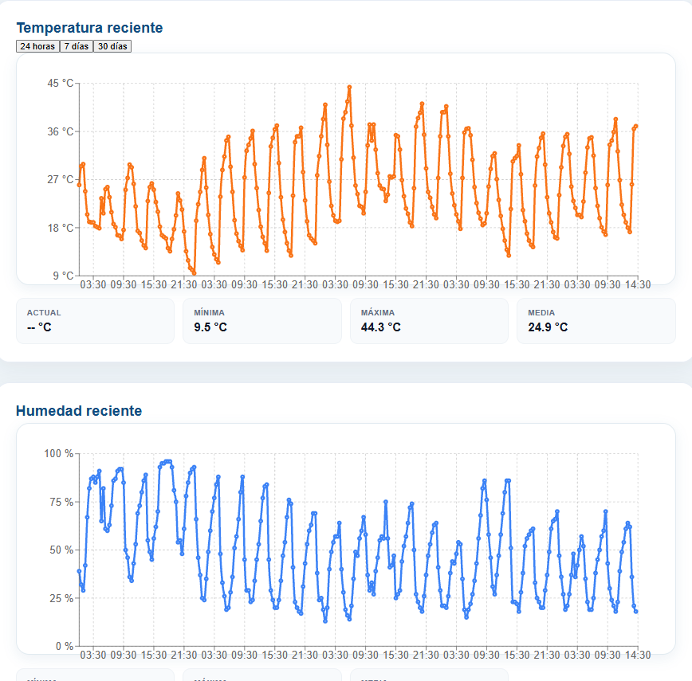
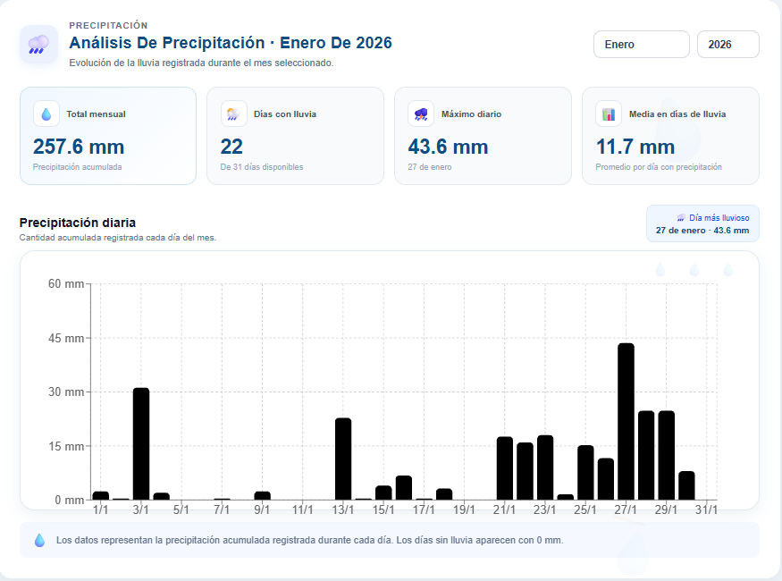
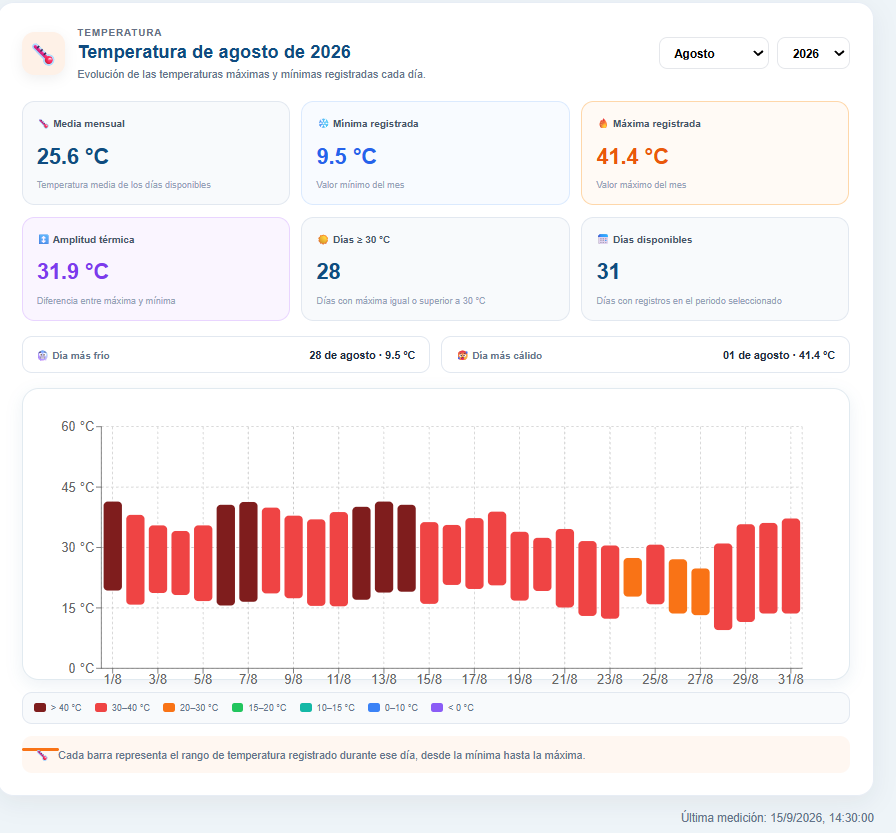
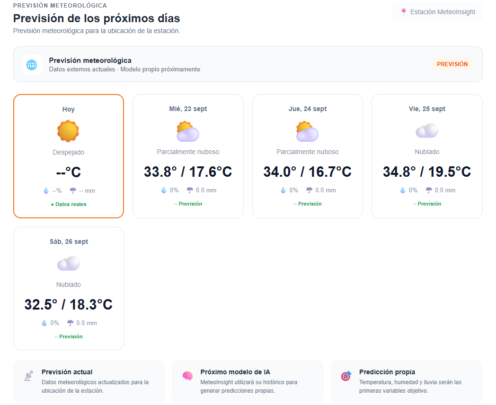

# MeteoInsight

Plataforma de monitorización meteorológica desarrollada como proyecto de portfolio para visualizar, analizar y explorar datos procedentes de una estación meteorológica personal.

MeteoInsight combina un backend desarrollado con Spring Boot, una interfaz web en React y una base de datos PostgreSQL para almacenar y consultar observaciones meteorológicas.

## Características

- 🌡️ Monitorización de temperatura
- 💧 Monitorización de humedad
- ⏱️ Presión atmosférica
- 💨 Velocidad y dirección del viento
- 🌧️ Análisis de precipitación
- 📊 Estadísticas meteorológicas
- 📈 Evolución y tendencias
- 🗓️ Consulta del histórico de mediciones
- 🌦️ Previsión meteorológica
- 🗺️ Localización de la estación mediante mapa interactivo
- 🛰️ Vista de mapa y satélite
- 🐳 Entorno PostgreSQL mediante Docker
- 📥 Importación de datos meteorológicos desde CSV

## Tecnologías

### Frontend

- React
- JavaScript
- Vite
- Recharts
- Leaflet
- React Leaflet
- CSS

### Backend

- Java
- Spring Boot
- Spring Data JPA
- Hibernate
- Maven

### Base de datos

- PostgreSQL

### Infraestructura

- Docker
- Docker Compose

## Arquitectura

El proyecto está dividido en tres partes principales:

MeteoInsight
│
├── frontend
│   └── React + Vite
│
├── backend
│   └── Spring Boot
│
└── docker
    └── PostgreSQL

┌─────────────────────┐
│      React          │
│     Frontend        │
└──────────┬──────────┘
           │
           │ HTTP / REST
           ▼
┌─────────────────────┐
│    Spring Boot      │
│      Backend        │
└──────────┬──────────┘
           │
           │ JPA / Hibernate
           ▼
┌─────────────────────┐
│     PostgreSQL      │
│   Weather data      │
└─────────────────────┘

# Dashboard

El dashboard centraliza la información meteorológica de la estación y permite consultar diferentes aspectos de los datos.

# Monitorización

La pantalla principal muestra los valores meteorológicos actuales disponibles:

Temperatura
Humedad
Presión
Viento
Dirección del viento
Precipitación
Histórico

La aplicación permite buscar mediciones concretas dentro del histórico almacenado y consultar los valores registrados en una fecha y hora determinada.

# Estadísticas

MeteoInsight calcula diferentes estadísticas a partir de las observaciones almacenadas, incluyendo:

Temperatura mínima
Temperatura máxima
Temperatura media
Velocidad media del viento
Racha máxima
Humedad
Precipitación

El módulo de precipitación permite analizar los datos de lluvia por día y consultar:

Precipitación mensual
Días con lluvia
Máximo diario
Media de precipitación en días con lluvia
Día con mayor precipitación
Temperatura

El análisis de temperatura permite consultar:

Media mensual
Temperatura mínima
Temperatura máxima
Amplitud térmica
Días con temperaturas iguales o superiores a 30 °C
Día más frío
Día más cálido
Viento

El dashboard incorpora información sobre:

Velocidad actual
Velocidad media
Racha máxima
Dirección predominante
Distribución de direcciones mediante una rosa de viento

# Tendencias

MeteoInsight analiza la evolución reciente de diferentes variables meteorológicas y muestra si presentan una tendencia ascendente, descendente o estable.

Estas tendencias se utilizan como análisis de los datos disponibles y no como predicciones meteorológicas.

# Previsión

La aplicación incorpora una previsión meteorológica de varios días utilizando datos externos.

La arquitectura está preparada para incorporar posteriormente modelos propios de predicción basados en el histórico almacenado.

# Mapa de la estación

La ubicación de la estación se muestra mediante un mapa interactivo desarrollado con Leaflet.

El usuario puede alternar entre:

Mapa de calles
Vista por satélite

Además, el marcador de la estación muestra información meteorológica asociada a la última medición disponible.

# Backend

El backend expone una API REST para proporcionar los datos meteorológicos al frontend.

Algunos de los recursos disponibles incluyen:

GET /api/v1/health
GET /api/v1/station
GET /api/v1/observations/latest
GET /api/v1/observations/stats
GET /api/v1/observations/history
GET /api/v1/observations/wind/directions
GET /api/v1/observations/rain/monthly
GET /api/v1/observations/temperature/monthly
POST /api/v1/observations/import

El backend utiliza Spring Data JPA para acceder a PostgreSQL y separar la lógica de acceso a datos de la lógica de negocio.

# Base de datos

Las observaciones meteorológicas se almacenan en PostgreSQL.

Entre los datos registrados se encuentran:

Fecha y hora de observación
Temperatura
Humedad
Presión
Precipitación
Intensidad de lluvia
Velocidad del viento
Dirección del viento
Ejecución del proyecto
Requisitos

Antes de ejecutar el proyecto es necesario disponer de:

Java 21
Maven
Node.js
npm
Docker Desktop

1. Clonar el repositorio

git clone https://github.com/pablogala03/meteoinsight.git
cd meteoinsight

2. Configurar las variables de entorno

Crear un archivo .env tomando como referencia:

.env.example

Ejemplo:

DB_URL=jdbc:postgresql://localhost:5432/meteoinsight
DB_USERNAME=meteo
DB_PASSWORD=tu_password

El archivo .env no debe subirse al repositorio.

3. Iniciar PostgreSQL

Desde la carpeta docker:

cd docker
docker compose up -d

4. Ejecutar el backend

Desde backend:

cd ../backend
mvn spring-boot:run

El backend estará disponible en:

http://localhost:8080

5. Ejecutar el frontend

En otra terminal:

cd frontend
npm install
npm run dev

El frontend estará disponible normalmente en:

http://localhost:5173
Importación de datos

MeteoInsight permite importar datos históricos mediante archivos CSV.

El endpoint de importación es:

POST /api/v1/observations/import

El archivo se envía mediante multipart/form-data utilizando el campo:

file

Este sistema permite utilizar datos históricos para desarrollar y probar las diferentes visualizaciones antes de conectar la aplicación directamente con la estación meteorológica.

Próximas mejoras

El proyecto continúa en desarrollo. Algunas de las siguientes mejoras previstas son:

- Integración directa con la estación meteorológica
- Modelo de Machine Learning para predicción meteorológica
- Comparación entre valores reales y predichos
- Predicción de temperatura y otras variables
- Despliegue de la aplicación
- Mejoras adicionales de responsive design
- Ampliación de tests
- Documentación técnica de la API
Objetivo del proyecto

MeteoInsight nace como proyecto de portfolio para aplicar conocimientos de:

Desarrollo de aplicaciones
Java y Spring Boot
React
APIs REST
Bases de datos relacionales
Docker
Visualización de datos
Análisis de series temporales
Machine Learning

El objetivo es evolucionar progresivamente desde una plataforma de monitorización y análisis hasta un sistema capaz de generar predicciones meteorológicas utilizando datos históricos reales.

Autor

Pablo Fernández

Proyecto desarrollado como parte de mi portfolio profesional.

⭐ Si te resulta interesante el proyecto, puedes consultar el código completo en este repositorio.

### 2. Guarda el archivo

Después, desde:

C:\meteo\meteoinsight

ejecuta:

git add README.md
git commit -m "docs: add professional project README"
git push origin main